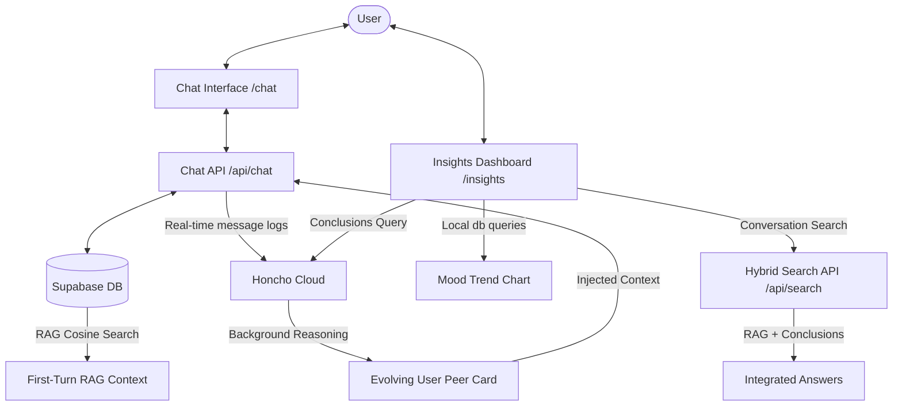

# Design Spec: Honcho Memory Integration & Insights Dashboard

Implementing a deep cognitive memory layer using Honcho Cloud alongside our existing Supabase RAG system, complete with a beautiful dark-mode Insights Dashboard, longitudinal conversational search, proactive prompting, and weekly reflection digests.

---

## 1. Architectural Overview

We are building a **dual-layer memory architecture**:
1. **Low-Level RAG Layer (Supabase + pgvector)**: Houses structured, user-edited diary entries. Excellent for retrieving specific, high-fidelity facts and search queries.
2. **Cognitive Memory Layer (Honcho Cloud)**: Captures raw conversations, tracks evolving behavioral/emotional trends, and synthesizes a persistent, low-latency **Peer Card** (user psychological profile) that is injected at the start of every chat session.

---

## 2. Component Design & Changes

### 2.1 Dependencies & Setup
* **Install SDK**: Add `@honcho-ai/sdk` to `package.json`.
* **API Configuration**:
  * `HONCHO_API_KEY`: Stored in `.env` (provided by user).
  * `api.honcho.dev` will be utilized as the default hosted cloud base.
  * Define two peers: the User Peer (mapped to the Supabase `auth.user.id` UUID) and the Agent Peer (`companion`).

### 2.2 Dynamic Session Syncing & Context Injection
* **Syncing Turn-by-Turn**:
  * In `app/api/chat/route.ts`, when a chat interaction occurs:
    1. Initialize the Honcho client.
    2. Get or create the human peer (`userId`), agent peer (`companion`), and session (`conversationId`).
    3. Push the new messages to the Honcho session history via `session.addMessages()`.
* **First-Turn Context Enrichment**:
  * When a new conversation begins (or first turn is run):
    1. Retrieve the user's latest **Peer Card** (representation relative to the companion peer) from Honcho.
    2. Inject this psychological summary as a background system instruction (`[PEER SNAPSHOT]`) so the companion has immediate context on the user's psychological state.

### 2.3 Proactive Prompting (AI Greeting)
* When a user opens an empty chat session:
  * Instead of displaying a static empty state, the frontend fires a request to `/api/chat/proactive-greeting`.
  * The handler retrieves the user's latest Honcho Peer Card and recent emotions.
  * It prompts Gemini to generate a highly personalized, empathetic opening greeting (e.g., *"Hi there. I know you've been working through burnout with your team leader last week. How are you feeling heading into today?"*).
  * This greeting is rendered dynamically in the chat feed to kickstart reflection.

### 2.4 The Insights Dashboard (`/insights`)
A brand-new page (`app/insights/page.tsx`) designed to match the calm, premium dark-indigo theme of the existing application. It features:

1. **Interactive Mood Chart (SVG/CSS)**:
   * Queries emotions from past `journal_entries` in Supabase.
   * Renders a smooth interactive chart showing emotional intensity over time, grouped by categories (e.g., Anxiety, Joy, Sadness).
2. **Cognitive Profile Panel (Honcho Peer Card)**:
   * Displays the structured conclusions Honcho has derived about the user (e.g., Core Goals, Relationship Dynamics, Defense Mechanisms, Coping Patterns).
3. **Longitudinal Hybrid Search**:
   * A conversational search input allowing users to query their past (e.g., *"When did I last feel this anxious about my boss?"*).
   * Fires to `/api/search` which:
     1. Embeds the query and performs a Supabase pgvector cosine search on journal entries.
     2. Runs a semantic query against Honcho's derived peer conclusions.
     3. Feeds both results to Gemini to synthesize an insightful, cross-session response (e.g., *"You last felt this way on April 12th when discussing the quarterly review..."*).
4. **Weekly Reflection Digest Generator**:
   * A button that queries Honcho conclusions and conversation history for the past week, calls Gemini to synthesize a comprehensive reflection entry, and saves it into Supabase as a structured entry.

---

## 3. Database & Schemas

The dual-layer model does not require breaking modifications to the existing Supabase tables.
* **`conversations`** and **`journal_entries`** remain identical.
* The Honcho `session_id` maps perfectly to our Supabase `conversations.id` (UUID).
* The Honcho `peer_id` maps perfectly to the Supabase `auth.users.id` (UUID).

---

## 4. Verification & Testing Plan

### Automated Tests
* Mock Honcho API calls in isolation to ensure `session.addMessages` and `peer.representation` handle API failures gracefully without blocking chat flows.

### Manual Verification
* Start a new chat, verify a personalized AI greeting is generated based on recent entries.
* Send messages in a chat session, check that they are successfully recorded in the Honcho session history.
* Navigate to `/insights`, verify that the mood trend chart is plotted correctly using database entries.
* Run a longitudinal search, check that the synthesized response references both vector matches and Honcho memory.
